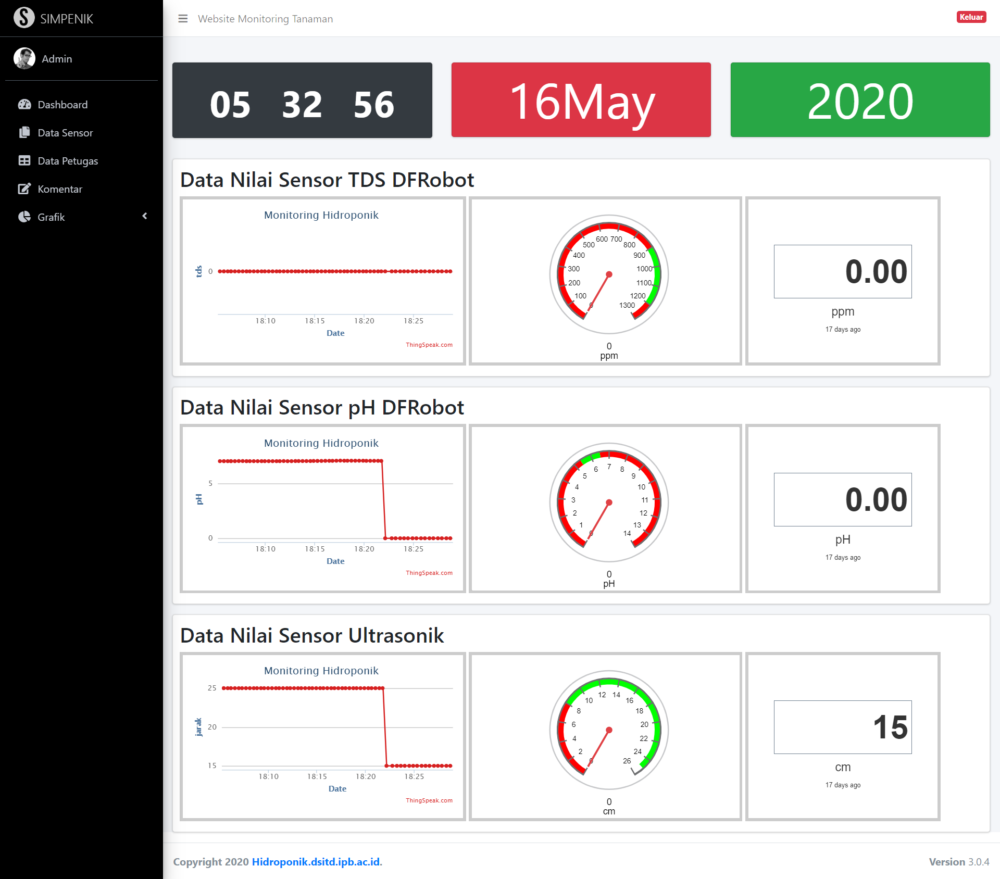
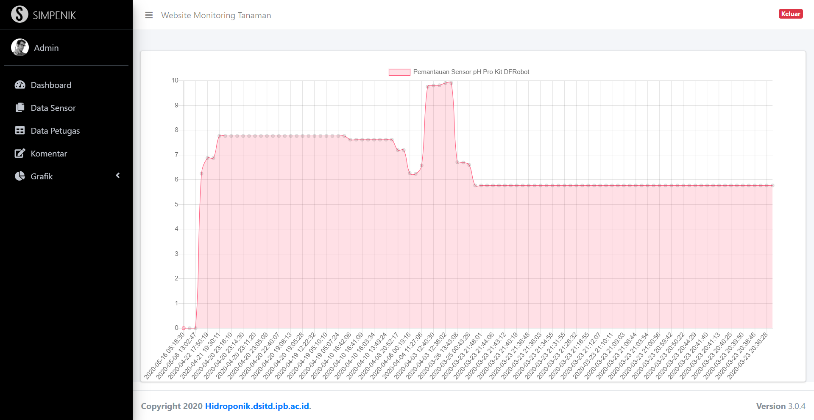

# Sitem Monitoring Tanaman Hidroponik

Direktorat Sistem Informasi dan Transformasi Digital IPB sedang mengembangkan budidaya tanaman pakcoy hidroponik dengan Deep Flow Technique dimana satu sistem tanam dalam hidroponik yang menggunakan genangan pada instalasi dan menggunakan sirkulasi dengan aliran pelan. Sistem ini menggunakan listrik sebagai penggerak pompa agar dapat dengan mudah mensirkulasi air nutrisi AB Mix ke seluruh akar tanaman. Oleh sebab itu air nutrisi harus selalu berada pada kondisi terbaik dimana berada pada rentang nilai yang telah ditentukan menggunakan tds meter dan ph meter, jika tidak maka tanaman tidak dapat tumbuh dengan baik yang menyebabkan daun berubah warna menjadi kuning yang mengindikasikan bahwa tanaman kekurangan nutrisi atau terserang penyakit
	Untuk mengatasi permasalahan tersebut, diperlukan mikrokontroller yang dapat diintegrasikan dengan tanaman hidroponik untuk memperoleh nilai kepadatan air lalu dikirim ke sebuah website menggunakan nodemcu sehingga tidak harus selalu datang ke lokasi tanaman hidroponik, ini merupakan suatu upaya efesiensi waktu sehingga staff dapat tetap melakukan pekerjaannya dengan produktif disamping melakukan budidaya tanaman hidroponik

Homepage Preview

Login Page Preview

Admin Page Preview

Data Preview

Graphic Preview

